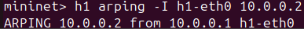
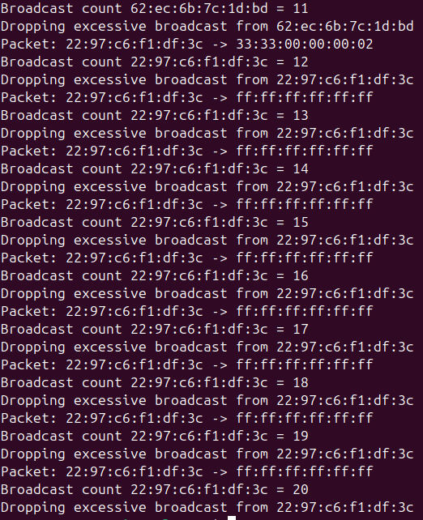
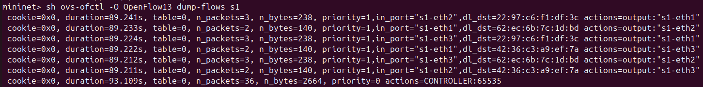
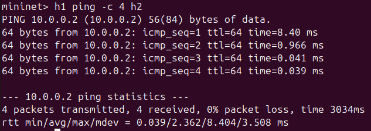
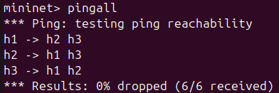
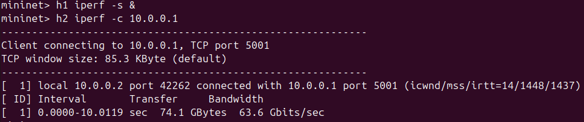

# 📡 Broadcast Traffic Control using SDN

**Author:** Aaron Sijo  
**SRN:** PES2UG24CS012

## 🧠 Project Description
This project implements **broadcast traffic control in a network using Software Defined Networking (SDN)**.

Using a Ryu controller and Mininet, the system:
- Detects broadcast and multicast packets  
- Monitors their frequency  
- Limits excessive broadcast traffic  
- Installs flow rules for efficient forwarding  

This helps prevent **network congestion and broadcast storms** while maintaining normal communication.

---

## ⚙️ Technologies Used
- Mininet  
- Ryu Controller  
- OpenFlow 1.3  
- Python  

---

## 🧪 Features Implemented
- Broadcast packet detection  
- Traffic monitoring and logging  
- Threshold-based broadcast filtering  
- Learning switch behavior  
- Flow rule installation  
- Performance evaluation (Latency & Throughput)

---

## 📸 Screenshots

### 🔹 Broadcast Detection (Initial)


---

### 🔹 Broadcast Control (Threshold Applied)


---

### 🔹 Flow Rule Installation


---

### 🔹 Latency Measurement


---

### 🔹 Connectivity Check


---

### 🔹 Throughput Measurement


---

## 🚀 How to Run

### 1. Start Controller
```bash
ryu-manager broadcast_control.py
